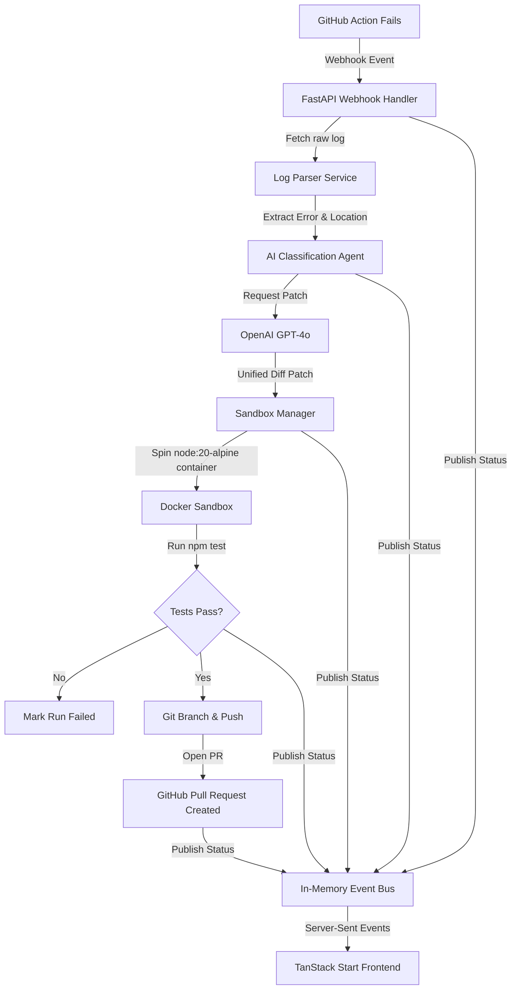

# 🤖 AutoFix.sh

> **Autonomous, AI-Powered Self-Healing CI/CD Deployment Agent**

AutoFix.sh is an autonomous self-healing deployment platform that monitors GitHub action failures, diagnoses errors, generates AI-powered code repairs, validates them in isolated Docker sandboxes, and automatically opens pull requests with the verified fixes—all monitored through a beautiful real-time DevOps dashboard.

---

## 🚀 Key Features

- **🔍 Intelligent Log Parsing**: Automatically extracts error stack traces, failing files, and specific line numbers from build/test logs.
- **🧠 AI-Powered Code Repair**: Leverages advanced LLMs (GPT-4o) with low-temperature settings to generate high-confidence code repairs.
- **🛡️ Isolated Sandbox Validation**: Deploys a Docker container (`node:20-alpine`) to clone the repository at the failed commit, apply the patch, and run test suites before committing.
- **🤖 Automated Pull Requests**: Upon successful test verification, automatically pushes a branch and opens a GitHub Pull Request detailed with a breakdown of the repair.
- **⚡ Real-Time DevOps Console**: Built using TanStack Start & React 19, utilizing Server-Sent Events (SSE) to stream live repair timelines, command logs, and code diffs in a dark-mode UI.
- **⚙️ Granular Feature Gates**: Safety thresholds for confidence scores, sandbox execution toggles, and dry-run commit flags.

---

## 📐 Architecture Flow

The following diagram illustrates the lifecycle of a self-healing patch:



---

## 🛠️ Tech Stack

### Frontend Dashboard

- **Core Framework**: [TanStack Start](https://tanstack.com/router/v1/docs/start/overview) (React 19 + TypeScript)
- **Styling**: [Tailwind CSS v4](https://tailwindcss.com/)
- **UI Components**: [Shadcn UI](https://ui.shadcn.com/) / Radix UI
- **Icons**: [Lucide React](https://lucide.dev/)
- **Build System**: Vite 7 & Bun

### Backend Engine

- **API Framework**: [FastAPI](https://fastapi.tiangolo.com/) (Python 3.11+)
- **Server**: Uvicorn
- **SDKs**: Docker SDK, OpenAI Python API, PyGithub
- **Event System**: Server-Sent Events (SSE) with an asynchronous in-memory event bus
- **Logging**: Structlog

---

## 📁 Repository Structure

```
├── backend/                     # FastAPI Python Backend
│   ├── agents/                  # AI repair prompts and agent pipeline
│   │   ├── fix_agent.py         # Main orchestration agent
│   │   └── prompts.py           # Unified diff generation prompts
│   ├── api/                     # REST API & Webhook endpoints
│   ├── github/                  # GitHub App webhook & API clients
│   ├── models/                  # Pydantic data schemas
│   ├── sandbox/                 # Docker container runner & workspace setup
│   ├── services/                # Log parsing, event bus, and states
│   ├── main.py                  # Backend server entrypoint
│   └── requirements.txt         # Python dependencies
├── src/                         # TanStack Start React Frontend
│   ├── components/              # Shared UI components and layout
│   ├── routes/                  # File-based TanStack routes
│   │   ├── dashboard.tsx        # Main metrics console
│   │   ├── deployments.$id.tsx  # Detailed live deployment repair view
│   │   └── settings.tsx         # Sandbox & API configuration
│   ├── styles.css               # Tailwind CSS v4 custom theme
│   ├── server.ts                # Server entrypoint
│   └── router.tsx               # App router configuration
├── wrangler.jsonc               # Cloudflare configuration
├── package.json                 # Frontend dependencies
└── vite.config.ts               # Vite configuration
```

---

## ⚙️ Configuration

Copy `.env.example` to `.env` in the backend directory and configure the environment variables:

```bash
# Server Setup
HOST=0.0.0.0
PORT=8000
DEBUG=True

# GitHub App Integration
GITHUB_APP_ID=your-github-app-id
GITHUB_APP_PRIVATE_KEY=your-private-key-pem-content
GITHUB_WEBHOOK_SECRET=your-webhook-secret
GITHUB_CLIENT_ID=your-client-id
GITHUB_CLIENT_SECRET=your-client-secret

# OpenAI Configuration
OPENAI_API_KEY=your-openai-key
OPENAI_MODEL=gpt-4o

# Sandbox Settings
SANDBOX_IMAGE=node:20-alpine
SANDBOX_TIMEOUT_SECONDS=180
SANDBOX_TEST_COMMAND=npm ci && npm test

# Feature Flags
AUTO_COMMIT_ENABLED=True
SANDBOX_ENABLED=True
```

---

## 🚀 Getting Started

### Prerequisites

- [Docker Desktop](https://www.docker.com/products/docker-desktop/) (must be running for sandboxed validation)
- Python 3.11+
- Node.js (v20+) or Bun

### 1. Run the Backend Server

Go to the `backend/` directory, set up your environment, and run:

```bash
cd backend
python -m venv venv
source venv/bin/activate  # On Windows: venv\Scripts\activate
pip install -r requirements.txt
python main.py
```

Alternatively, on Windows you can run:

```cmd
backend\start.bat
```

The FastAPI documentation will be available at [http://localhost:8000/api/docs](http://localhost:8000/api/docs).

### 2. Run the Frontend Dashboard

From the root of the project, install dependencies and start the development server:

```bash
npm install
npm run dev
```

The frontend dev server runs at [http://localhost:8080](http://localhost:8080).

---

## 🛡️ License

This project is private and proprietary.
